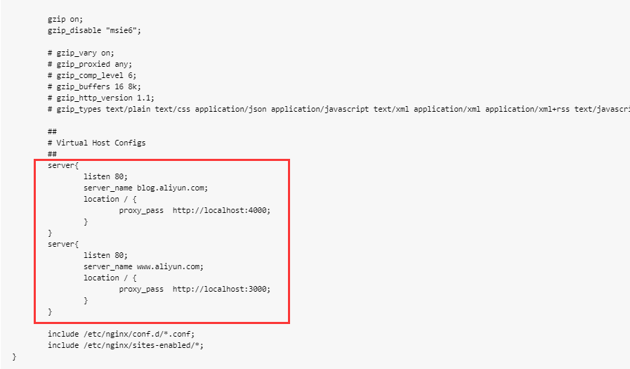
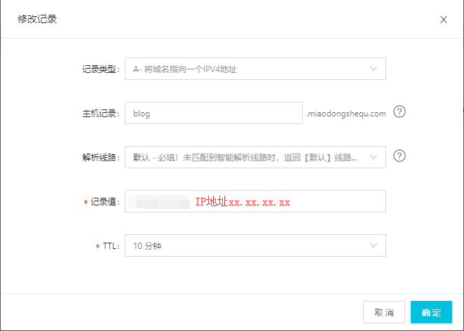
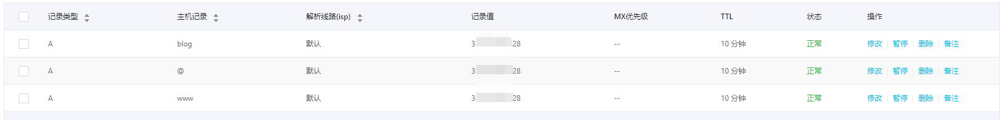

### 教程环境
* 阿里云ECS ubuntu16.04

### 安装教程
```shell
# 安装命令
sudo apt-get install nginx

#安装完成后默认自动启动（备用）
sudo /etc/init.d/nginx start|stop|restart
```

### 配置
```shell
#配置文件路径/etc/nginx/nginx.conf

#先备份
sudo cp /etc/nginx/nginx.conf /etc/nginx/nginx.conf.back
#修改内容
sudo vim /etc/nginx/nginx.conf

```
选取修改前的配置文件http部分内容
```
http {

	##
	# Basic Settings
	##

	sendfile on;
	tcp_nopush on;
	tcp_nodelay on;
	keepalive_timeout 65;
	types_hash_max_size 2048;
	# server_tokens off;

	# server_names_hash_bucket_size 64;
	# server_name_in_redirect off;

	include /etc/nginx/mime.types;
	default_type application/octet-stream;

	##
	# SSL Settings
	##

	ssl_protocols TLSv1 TLSv1.1 TLSv1.2; # Dropping SSLv3, ref: POODLE
	ssl_prefer_server_ciphers on;

	##
	# Logging Settings
	##

	access_log /var/log/nginx/access.log;
	error_log /var/log/nginx/error.log;

	##
	# Gzip Settings
	##

	gzip on;
	gzip_disable "msie6";

	# gzip_vary on;
	# gzip_proxied any;
	# gzip_comp_level 6;
	# gzip_buffers 16 8k;
	# gzip_http_version 1.1;
	# gzip_types text/plain text/css application/json application/javascript text/xml application/xml application/xml+rss text/javascript;

	##
	# Virtual Host Configs
	##

	include /etc/nginx/conf.d/*.conf;
	include /etc/nginx/sites-enabled/*;
}
```
修改位置# Virtual Host Configs下方，只要确保在http内部就OK，追加内容在红框区域

将下方内容根据读者自身情况修改，修改上图中的位置内容
```
  server{
    		listen 80;
    		server_name blog.aliyun.com;
    		location / {
        		proxy_pass  http://localhost:4000;
    		}
	}
	server{
    		listen 80;
    		server_name www.aliyun.com;
    		location / {
        		proxy_pass  http://localhost:3000;
    		}
	}
```
**注意我们这里的server_name要保证在阿里云上解析**
添加记录类型为A的三级域名，记录值为你的IP地址，这里解析一个blog的三级域名blog.xxx.com

最终结果是所有域名指向同一个IP



还等什么，赶快试试吧，记得修改配置完成后重新启动nginx(文章开头我们提到的，还记得吗？)
```
sudo /etc/init.d/nginx restart
```

最后，打开浏览器，enjoy it!

### 参考文献
https://blog.csdn.net/javahighness/article/details/80500437
